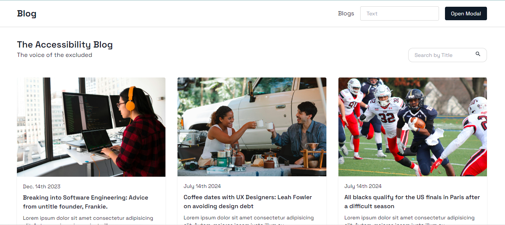
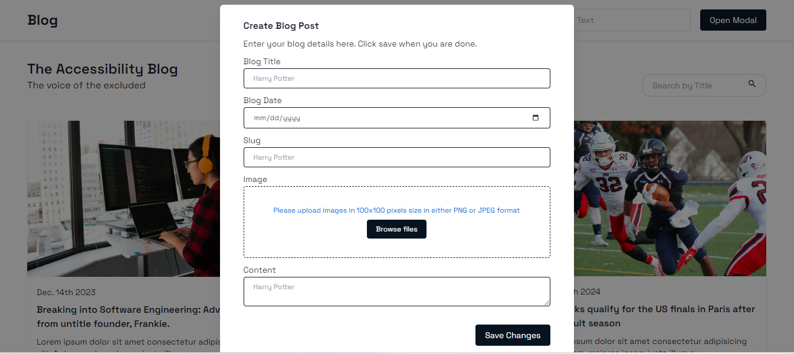

## Technologies used

* Nextjs
* Typescript
* Tailwind
* Chakra UI

## Installation Instructions

First, run the development server:

```bash
1. clone the repository

"git clone https://github.com/Marcos8060/blog_test.git"

2. Install the packages => "npm install"

3. Run the development server => "npm run dev"

```


Open [http://localhost:3000](http://localhost:3000) with your browser to see the result.


## Landing Page


## Details Page


## Create Blog Section



## User flow Instructions

* Click the individual blog item to view its details section.
* You can search the blogs by title
* You can navigate the pages through the pagination added at the bottom. Each page is set to hold a maximum of 5 blogs
